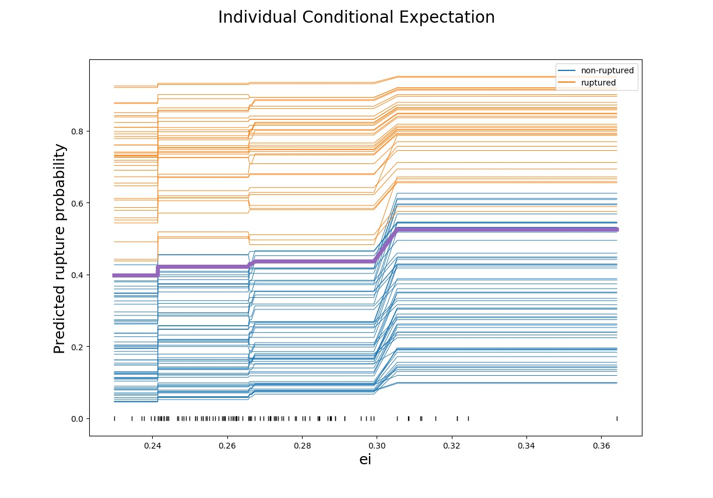
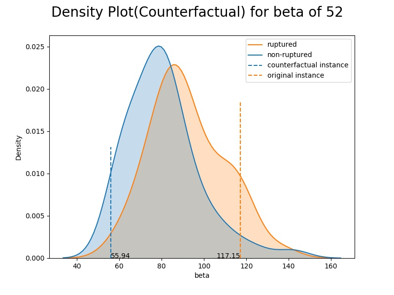

# Study and Visualization of Model Agnostic Interpretable Machine Learning Approaches

The main task was to implement few Interpretable Machine Learning models that could help answer some questions of the underlying classification black-box model. The main aim here is to help make the end-user trust the model and help one understand why it predicted the way it did. This could help the user make better decisions. 
  
## Dataset

The dataset considered for this particular task was the morphological and demographic features of 100 intracranial aneurysms corresponding to 93 patients recorded at the university hospital of Magdeburg, Germany. There were few missing values in the otherwise clean data. Due to the issues of data privacy, the dataset is not uploaded in the repository along with the source code and other resources. 

## Model Design

Even though the intent of the task was not to come up with the best model, two algorithms were chosen based on the motivation from http://wwwisg.cs.uni-magdeburg.de/visualisierung/wiki/data/media/files/misc/niemann_2018_cbms.pdf where the comparison between different models was performed on the same dataset - Gradient Boosting Trees (also XGBoost) and Support Vector Machines. The best model was chosen based on nested cross-validation of all three algorithms fit on three variations of the dataset - one where a standard normalization was applied, one where the dataset was transformed into Z-scale and one where no transformations were applied. Based on grid search hyperparameter tuning, XGBoost and SVM with a generalization performance of 65 and 64 per cent accuracy on the z-score transformed dataset were chosen for further study.

## Questions
  1. Which are the important features that contributed towards the prediction of the aneurysm classes?
  2. Does change in a feature value affect prediction of an instance?
  3. What is the possible range of values a feature of an instance could take for a particular aneurysm class? Or, at which value of the feature does the classification label changes?
  4. Which minimal set of features played a significant role in the prediction of aneurysm classes and how?

## Interpretable Machine Learning Models

### Model Reliance
  
  
### Individual Conditional Expectation
  
### Counterfactuals
  
### Decision Ruleset

## Graphical User Interface for the Visualization 

The objective of the whole task is to design and implement a prototypical GUI that explains the above mentioned four model agnostic approaches. Hence, we came up with a GUI based solution called G-MARC (GUI for Model Agnostic explanations for Rupture status Classification).  It is implemented using the PyQt software which is a FOSS widget toolkit for creating GUIs. The GUI is divided into 4 tabs for each of the model agnostic techniques. Each tab provides the option for the user to select the model for which he/she wants the result.  In addition to that, various other options such as selecting the features, type of plot, choosing instances and selecting a particular aneurysm class are provided based on the requirement of the technique.  The GUI is also made user-friendly by providing a toolbar for the plots where the user can stretch or adjust the plot, zoom values, modify the layout and axes and also save each plot as an image to his/her local system
  
  
### Add-on Feature - Report Generation and Download as PDF

In addition to the tasks, I have included an option for the user to download the report with the necessary information and plots of each task. Saving and writing the plots (as images) to the report is quite tedious in terms of time complexity. So, this process has been implemented as a separate thread to make sure that the GUI does not become non-responsive.  Also a Help option is provided in the menu bar which is moreover a guide for the user regarding the GUI.

## Product Release

The  whole  application  has  been  converted  into  a  single  standalone  exe-cutable.  The GUI with all the features are compiled into a Windows (platform-specific) executable file with the help of cxfreeze package of python.  This helps the  user  to  install  the  application  without  manual  installation  of  python  or any of its dependencies by running the msi file by following the INSTALL.txt provided along with it. But sometimes there might be some dll dependencies that aren’t sorted out automatically by cxfreeze.
