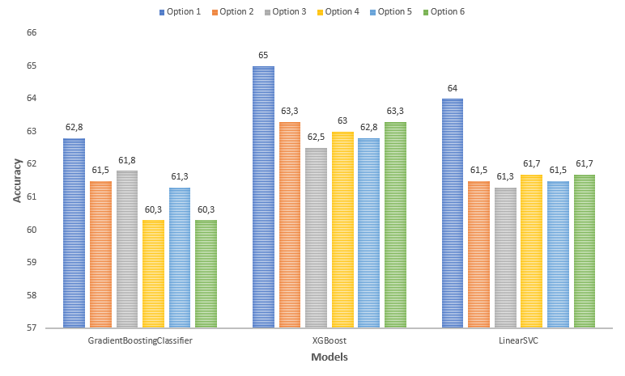
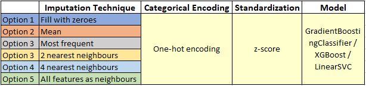
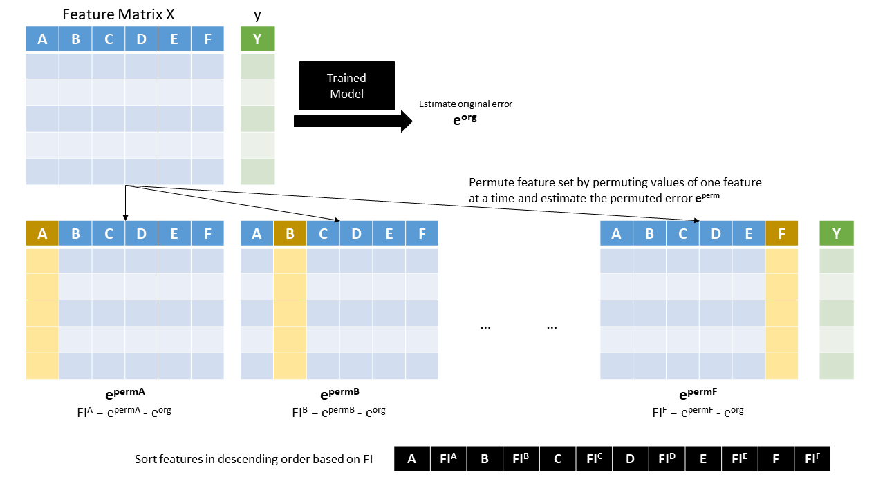
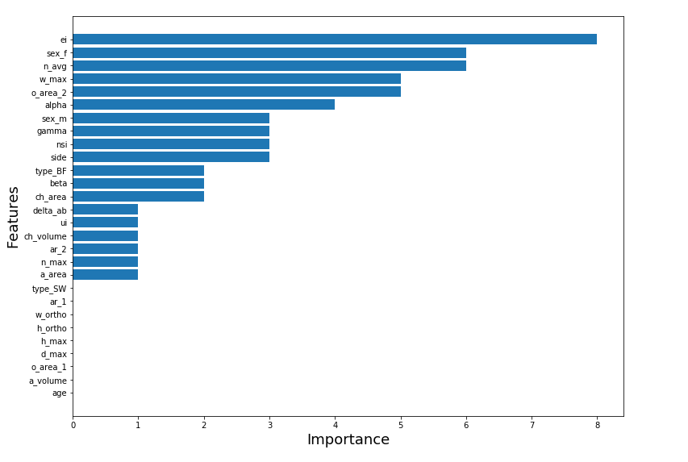
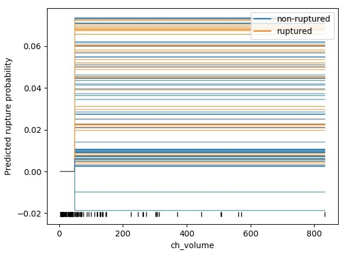
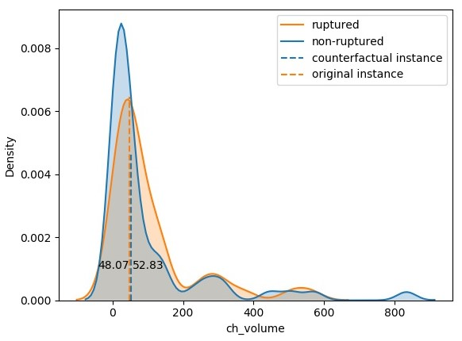
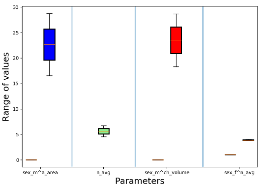
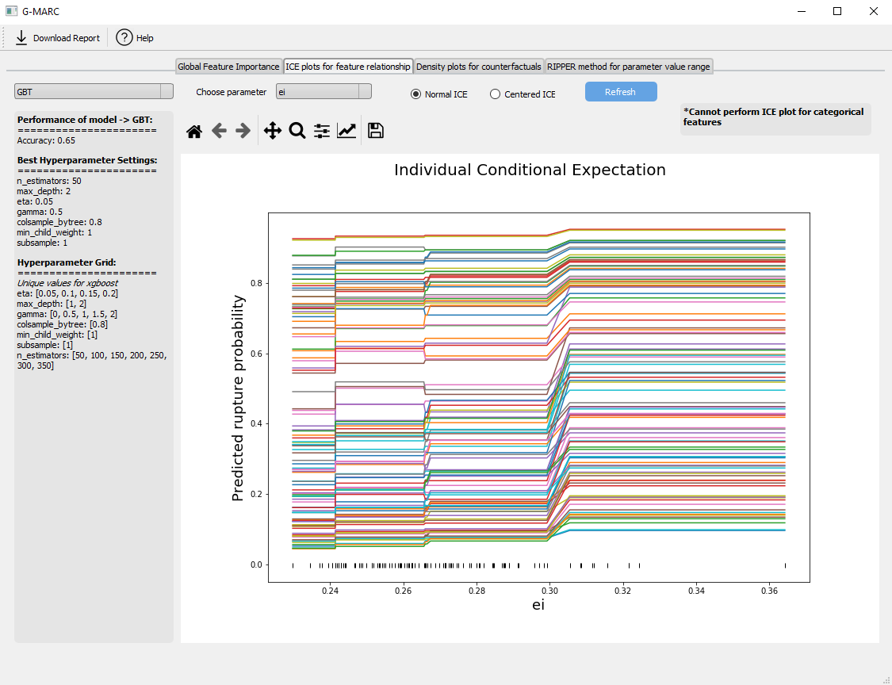

# Study and Visualization of Model Agnostic Interpretable ML Approaches

The main task was to implement few **Interpretable Machine Learning models** that could help answer some questions of the black-box model's classification predictions of the aneurysm's rupture status. The main aim here is to help make the end-user trust the model and to understand why it predicted the way it did with the help of model-agnostic explanations. 
  
## Dataset

The dataset considered for this particular task was the morphological and demographic features of 100 intracranial aneurysms corresponding to 93 patients recorded at the university hospital of Magdeburg, Germany. There were few missing values in the otherwise clean data. Due to the issues of data privacy, the dataset is not uploaded in the repository along with the source code and other resources. 

## Model Design

Even though the intent of the task was not to come up with the best model, two algorithms were chosen based on the motivation from http://wwwisg.cs.uni-magdeburg.de/visualisierung/wiki/data/media/files/misc/niemann_2018_cbms.pdf where the comparison between different models was performed on the same dataset - Gradient Boosting Trees (also XGBoost) and Support Vector Machines. The best model was chosen based on nested cross-validation of all three algorithms fit on three variations of the dataset - one where a standard normalization was applied, one where the dataset was transformed into Z-scale and one where no transformations were applied. Based on grid search hyperparameter tuning, XGBoost and SVM with a generalization performance of 65 and 64 per cent accuracy on the z-score transformed dataset were chosen for further study.

## Questions
  1. Which are the important features that contributed towards the prediction of the aneurysm classes?
  2. Does change in a feature value affect prediction of an instance?
  3. What is the possible range of values a feature of an instance could take for a particular aneurysm class? Or, at which value of the feature does the classification label changes?
  4. Which minimal set of features played a significant role in the prediction of aneurysm classes and how?

## Interpretable Machine Learning Models

### Model Reliance

Model-agnostic interpretation methods provide a great deal of flexibility. This means various interpretation methods can anyway be applied irrespective of which machine learning model is used. On the other hand, Model-specific interpretation methods restrict the explanation to that model alone. For example, algorithms like RandomForest and XGBoost automatically calculates important features on a trained predictive model. The second distinction is between global and local feature importance. Local feature importance evaluates the importance of features in case of prediction of a sub-problem. Whereas, global feature importance considers the overall predictions into account. Thus, to define the most important global features irrespective of the model used, we went for a model agnostic approach called model reliance (MR). MR is a permutation feature importance algorithm. The whole process of permutation feature importance is as explained in the figure given below. 
  
  
We implemented model reliance for XGBoost and SVM models and have provided the results in terms of a horizontal bar chart. The MR measure for each instance was the subtraction between the two errors. This could be a workaround when the original estimated error is zero.  
  
### Individual Conditional Expectation

A black-box model can have complicated parameters which can range from a few thousand to millions for a real-world dataset. A key question about model interpretation is 'How does the model inputs work?' or to rephrase 'How does change in a particular variable affect the model's prediction?'. One of the ways as discussed in the previous section, feature importance shows the strength of the relationship between a variable and model's prediction. But it lacks in providing any functional relationship between model inputs and predictions.  

Individual conditional expectations (ICE) is a disintegrated form of Partial Dependence Plot (PDP) from a visual perspective. It plots one individual line graph for every instance which shows the output change when values of feature changes. Each line establishes a homogeneous (if any) relationship between an observation with different values of the feature in focus thereby giving end-user several inferences of conditional relationships modelled by the black-box algorithm.  

  
  
  The above ICE plot shows that of the feature 'ch_volume' where x-axis shows a range of feature value and the y-axis shows values ranging from 0 to 1 showing the probability of rupture classification. Each line also shows rupture status and a PDP shows an overall trend.
  
### Density plots to explain Counterfactuals

Counterfactual explanations are in the form of 'if x had not occurred, y would not have occurred'. Counterfactual examples are hypothetical instances which flip the prediction of the original instance. Due to a large number of instances, it is usually challenging to represent the higher number of counterfactuals in a more meaningful format. So for this task, the nearest counterfactual for every feature is considered and hence shown using a density plot. 

We select one instance from the data in order to explain the learned model. We use the range of each feature (min value of the feature in the dataset and max value of the feature in the dataset) to create example counterfactual value. For each instance, we change only one feature value at a time and replace it with the calculated feature value to create our example counterfactual instance. We create 100 such example counterfactual instances. The reason for choosing 100 was that each time the number of counterfactual instances for an instance would have exactly 99 (since the original dataset had 100) so that perturbing feature values within a range for a good number of instances would be a good justification rather than randomly choosing a number. We now look for counterfactual instances that can flip the target value from 'ruptured' to 'unruptured' or vice versa. We then predict the outcome of example instances using our model. We then return the first example instance that changes the target value of the instance as our counterfactual instance. 

  
  
The above counterfactual represents the density plot of the feature 'ch_volume' for instance number 77. The original value of the instance is represented by an orange dashed line and the counterfactual value is represented by a blue dashed line. As visible from the plot, the target value of the instance 77 changes from ruptured to non-ruptured if the value of ch\_volume changes from 48.07 to 52.83. 

### Decision Ruleset using Sequential Covering Algorithm

Decision rules are one of the most interpretable methods since they are easier to explain in natural language. The structure of a decision rule is in terms of the if-then structure. Generally, decision rules are easier to explain if they are short in length, i.e., few feature value combined with an AND logical operation to give a certain prediction. A set of decision rule is called the decision set. 

For this task, decision rules are used to explain the prediction of the learned model for classes. To learn the rules, we use a sequential covering approach that learns rules and create a decision set covering the whole dataset. For this, the Ripper algorithm is used to implement decision rules which is one of the variants of sequential covering decision rule technique. Sequential covering technique first learns a single rule that applies to most of the data in the data set. It then adds the rule to the decision set and then removes the data is used to learn the rule. Consecutively, the next rule is learned on the remaining data set. The process is repeated until all the data are covered. At the end, a decision set is created. 

We used python 'Wittgenstein' package that helps us find the decision set of both classes. Then, using the predicted outcomes, we use the Ripper algorithm to find out decision rules by providing an instance feature and predicted the outcome as input for each class label.

In the above figure, the range of the first rule of the decision set 'sex_m ^ area' is [0.0] for 'sex_m' and [16.53, 28.74] for 'a_area' and this rule is satisfied by 11 instances. The range of each parameter is represented by the box plot whereas the number of instances that are covered by each decision rules in the set is mentioned in the GUI. Different box plots (separated by vertical lines) in both figures give the value of different decision rules in the deciding set. Although the visualization method chosen to explain this task would not be an optimal one, each vertical line here represents the logical AND operation such that the overall decision set represents disjunction of conjunctions.

## Graphical User Interface for the Visualization 

The objective of the whole task is to design and implement a prototypical GUI that explains the above mentioned four model agnostic approaches. Hence, we came up with a GUI based solution called G-MARC (GUI for Model Agnostic explanations for Rupture status Classification).  It is implemented using the PyQt software which is a FOSS widget toolkit for creating GUIs. The GUI is divided into 4 tabs for each of the model agnostic techniques. Each tab provides the option for the user to select the model for which he/she wants the result.  In addition to that, various other options such as selecting the features, type of plot, choosing instances and selecting a particular aneurysm class are provided based on the requirement of the technique.  The GUI is also made user-friendly by providing a toolbar for the plots where the user can stretch or adjust the plot, zoom values, modify the layout and axes and also save each plot as an image to his/her local system
  
  
### Add-on Feature - Report Generation and Download as PDF

In addition to the tasks, I have included an option for the user to download the report with the necessary information and plots of each task. Saving and writing the plots (as images) to the report is quite tedious in terms of time complexity. So, this process has been implemented as a separate thread to make sure that the GUI does not become non-responsive.  Also, a Help option is provided in the menu bar which is moreover a guide for the user regarding the GUI.

## Product Release

The whole application has been converted into a single standalone executable.  The GUI with all the features is compiled into a Windows (platform-specific) executable file with the help of cxfreeze package of python.  This helps the user to install the application without manual installation of python or any of its dependencies by running the MSI file by following the INSTALL.txt provided along with it. But sometimes there might be some dll dependencies that aren’t sorted out automatically by cxfreeze.
