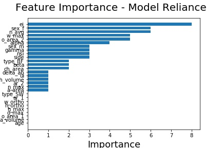

# Study and Visualization of Model Agnostic Interpretable Machine Learning Approaches

The main task is to implement few Interpretable Machine Learning models that could help answer questions of the underlying classification black-box model. The main aim here is to make the end-user trust the model and help her/him understand why the model predicted the way it did. This could help the user take better decisions. 
  
## Dataset

The dataset considered for this particular task are the demographics and morphological features of 100 intracranial aneurysms recorded at the university hospital of Magdeburg, Germany. This small dataset corresponds to 93 patients. There are few missing values in the otherwise clean data. Due to the issues of data privacy, the dataset is not uploaded in the repository along with the source code and other resources. 

## Model Design

Even though the intent of the task is not to come up with the best model, two algorithms were chosen as a motivation from http://wwwisg.cs.uni-magdeburg.de/visualisierung/wiki/data/media/files/misc/niemann_2018_cbms.pdf which was performed on the same dataset - Gradient Boosting Trees (also XGBoost) and Support Vector Machines. The best model were chosen based on nested cross validation of all three algorithms fit on three variations of the dataset - one where a standard normalization was applied, one where the dataset was transformed in to z-scale and one where no transformations were applied. Based on grid search hyperparameter tuning, XGBoost and SVM with a generalization performance of 65 and 64 percent accuracy on the z-score transformed dataset where chosen for further study.

## Questions
  1. Which are the important features that contributed towards the prediction of the aneurysm classes?
  2. Does change in a feature value affect prediction of an instance?
  3. What are the possible range of values a feature of an instance could take for a particular aneurysm class? Or, at which value of the feature does the classification label changes?
  4. Which minimal set of features played a significant role in prediction of aneurysm classes and how?

## Interpretable Machine Learning Models

### Model Reliance

### Individual Conditional Expectation
### Counterfactuals
### Decision Ruleset

## Graphical User Interface for the Visualization 
